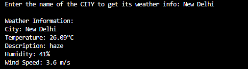

# NodeJS Weather App ☁️🌡

A simple and efficient **command-line Weather app** built using **Node.js**, allowing users to check current weather conditions directly in the terminal.

## Features 🚀

- 🌍 **Get weather by city name**
- 🌡 **Displays temperature, humidity, and weather conditions**
- ⚡ **Fast & lightweight CLI tool**
- 🔄 **Real-time weather updates**

## Technologies Used 🛠

- **Node.js** (Backend & CLI handling)
- **Axios** (Fetching weather data from API)
- **Inquirer.js** (Interactive CLI prompts)
- **Chalk** (Enhancing CLI output)

## Installation & Setup 📦

1. Clone the repository:
   ```sh
   git clone https://github.com/Taha-Lcode/cli-weather-app.git
   ```
2. Navigate to the project folder:
   ```sh
   cd cli-weather-app
   ```
3. Install dependencies:
   ```sh
   npm install
   ```
4. Run the CLI Weather App:
   ```sh
   node index.js
   ```

## Screenshots 📸


*User entering city name in CLI*

## Usage 📌

1. **Enter a city name** when prompted.
2. **View real-time weather details**, including temperature and conditions.
3. **Repeat for different locations** as needed.

## API Key Requirement 🔑

This app fetches real-time weather data from an external API (e.g., OpenWeatherMap). Ensure you have an API key and set it up in your project.

## Contribution 🤝

Feel free to fork this repository, improve the project, and submit a pull request!

---

Made with ❤️ by **Mohd Taha Saleem**
